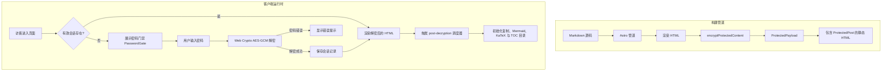

# 受密码保护的文章

恭喜！你已成功解锁此加密文章。浏览器已通过 Web Crypto API 配合 AES-256-GCM 与 PBKDF2 在本地成功解密此预编译内容。

---

## 1. 安全架构与核心特性

Shirone 的文章加密系统与受保护相册共享统一的安全基座，为静态发布提供高可靠的隐私保护：

1. **静态 HTML 构建零明文泄露**  
   在 Astro SSG 构建管道中，文章 Markdown 会先被编译为 HTML，并在输出页面前立即使用 AES-256-GCM 进行加密。最终发布的静态 HTML 中完全不包含受保护正文或大纲的明文内容。

2. **带 AAD 作用域绑定的认证加密**  
   - 密钥派生遵循 OWASP 推荐标准，采用 310,000 次 PBKDF2 迭代配合 SHA-256 与高强度随机 16 字节盐值；
   - 每次加密载荷均生成独立的 12 字节随机 IV；
   - 采用 AAD 绑定 `shirone-protected-content:1:post:${slug}`，确保密文无法在不同的文章或相册之间被重放。

3. **会话持久化与零磁盘密码存储**  
   - 解密后的内容缓存在临时的浏览器会话存储中（有效期 30 分钟）；
   - 明文密码绝不写入磁盘或持久化存储；
   - 在同一个会话内，解密状态可在 Swup 客户端路由跳转和页面刷新时无缝保持。

4. **全站防信息泄漏防护**  
   - **搜索引擎与站内检索**：静态页面不包含明文，避免搜索引擎和 Pagefind 索引私密内容；
   - **RSS 订阅源**：受保护文章在 RSS 中自动输出本地化占位符，防止 RSS 聚合器抓取敏感正文；
   - **卡片摘要与字数统计**：当配置 `hideHomeContent: true` 时，首页和归档卡片上的摘要与字数统计会被自动遮蔽；
   - **文章目录**：大纲层级在解锁前保持隐藏，解密后动态重建并与 M3E 样式无缝同步。

> **演示说明**：此演示文章的默认解锁密码为 `shirone-secret`。

---

## 2. 交互式富文本内容演示

文章解密后会协调运行时调度器，动态挂载代码高亮、代码折叠、交互式 Mermaid 图表、LaTeX 数学公式以及图片灯箱等组件。

### 2.1 代码块与语法高亮

下面的代码块测试了 Expressive Code 的语法高亮、复制操作与行装饰：

```typescript
import { decryptProtectedContent, type ProtectedPayload } from "@/utils/password-protection";

/**
 * 客户端文章解密示例
 */
async function unlockArticle(payload: ProtectedPayload, password: string): Promise<string> {
    const scope = payload.scope;
    console.log(`[Shirone] 正在解密作用域: ${scope}`);
    
    // 执行带 AAD 校验的 AES-256-GCM 解密
    const decryptedHtml = await decryptProtectedContent(payload, password, scope);
    console.log("[Shirone] 解密成功，内容长度:", decryptedHtml.length);
    return decryptedHtml;
}
```

```bash
# 验证构建与类型检查
npx.cmd astro check
pnpm.cmd type-check
pnpm.cmd test
```

### 2.2 Mermaid 架构流程图

下面的流程图通过 Mermaid 渲染，并在文章解密后动态绑定：



### 2.3 LaTeX 数学公式

行内公式测试：欧拉恒等式 $e^{i\pi} + 1 = 0$ 以及高斯积分 $\int_{-\infty}^{\infty} e^{-x^2} dx = \sqrt{\pi}$。

块级数学公式（支持水平滚动容器）：

$$
f(x) = \frac{1}{\sigma \sqrt{2\pi}} \exp\left( -\frac{(x - \mu)^2}{2\sigma^2} \right)
$$

$$
\mathcal{L}_{\text{AES-GCM}} = \text{GHASH}_H(A \parallel C \parallel L) \oplus \text{AES}_K(J_0)
$$

### 2.4 提示块

:::note 架构说明
该加密系统遵循原子化设计规范与最小改动约定，在不影响 SSR 稳定性的前提下实现完整的客户端解密链路。
:::

:::tip 主题适配
解锁后，可以尝试切换明暗模式或调整主题主色调；已解密的内容组件将动态适配当前生效的设计令牌。
:::

:::important 安全边界
静态客户端加密旨在防止未授权的普通浏览和自动化抓取检索。对于极高敏感度的商业机密，建议配合服务端认证体系。
:::

:::warning 密码遗失
静态加密没有中心化服务器数据库存储明文。一旦忘记密码，加密内容将无法找回。
:::

### 2.5 GitHub 仓库卡片

::github{repo="withastro/astro"}

---

## 3. 配置项参考

| 参数名 | 类型 | 是否必填 | 默认值 | 说明 |
| :--- | :--- | :--- | :--- | :--- |
| `encrypted` | `boolean` | 否 | `false` | 显式标记文章为加密状态。若设置了 `password` 则自动视为 `true`。 |
| `password` | `string` | 是 | 无 | 构建期用于加密、运行时用于解锁的明文密码。 |
| `passwordHint` | `string` | 否 | `""` | 在密码输入框下方展示的提示文字。 |
| `hideHomeContent` | `boolean` | 否 | `true` | 在首页卡片、归档列表和 RSS 中隐藏文章摘要与字数指标。 |

---

## 4. 总结

本文完整演示了 Shirone 中的加密全生命周期：静态产物零明文泄露、严苛的密码学认证、路由跳转与刷新时的会话持久化，以及运行时的动态二次水合。
