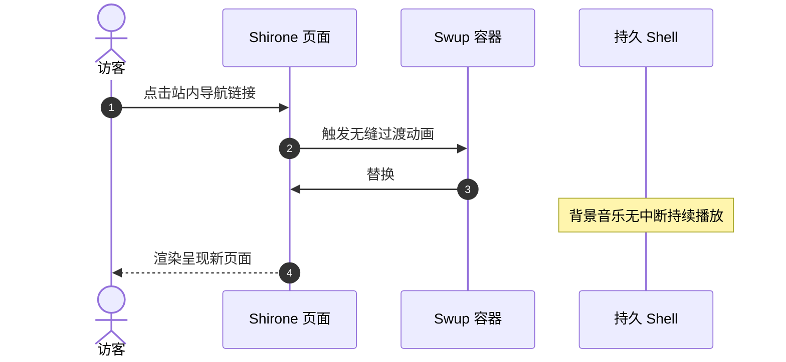

欢迎使用 **Shirone** —— 一款围绕 **Astro 7**、**Svelte 5** 与 **M3E** 设计系统打造的二次元表现力博客主题。

本指南将带你了解文章创建流程、Frontmatter 元数据规范、目录组织结构，以及开箱即用的全套 Markdown 与 MDX 扩展语法。

:::tip
Shirone 采用服务端优先渲染架构。在站内导航时，Swup 会平滑替换主内容容器，同时完整保留外层应用持久 Shell 与连续的背景音乐播放。
:::

---

## 1. 创建新文章

可以使用内置的 CLI 脚手架命令快速生成带有标准 Frontmatter 的新文章：

```bash
# 创建单文件文章
pnpm new-post my-first-post

# 或在子目录中创建文章
pnpm new-post guides/getting-started
```

生成的新文件将保存在 `src/content/posts/` 目录下。

---

## 2. Frontmatter 规范

每篇 Markdown (`.md`) 或 MDX (`.mdx`) 文章均以 YAML Frontmatter 代码块开头，用于定义元数据。

### 示例

```yaml
---
title: "探索 Material 3 Expressive 设计规范"
published: 2026-08-26
updated: 2026-08-27
publishedAt: 2026-08-26T10:00:00+08:00
updatedAt: 2026-08-27T09:30:00+08:00
pinned: true
description: "深入解析 Shirone 中的动态 HCT 色彩科学与流体过渡动效。"
image: "./cover.webp"
tags: [M3E, 设计, 前端]
category: 指南
draft: false
comment: true
---
```

### 支持的 Frontmatter 字段

| 字段名 | 类型 | 是否必填 | 说明 |
| :--- | :--- | :---: | :--- |
| `title` | `string` | **是** | 文章的主标题。 |
| `published` | `Date` | **是** | 发布日期，格式为 `YYYY-MM-DD`。 |
| `publishedAt` | `Date` | 否 | 精确发布时间点，用于同日发布多篇文章时的稳定排序。必须落在站点时区对应的 `published` 当天。 |
| `updated` | `Date` | 否 | 最后更新日期。填写后文章将展示更新提示徽章。 |
| `updatedAt` | `Date` | 否 | 精确更新时间点，供 RSS 订阅与元数据解析使用，需与 `updated` 配合使用。 |
| `pinned` | `boolean` | 否 | 是否置顶文章到列表顶部（默认：`false`）。 |
| `description` | `string` | 否 | 文章摘要，展示在卡片、搜索结果与 OpenGraph 分享中。 |
| `image` | `string` | 否 | 封面图路径。支持相对路径 (`./cover.webp`)、公开路径 (`/images/cover.jpg`) 或远程 URL。 |
| `tags` | `string[]` | 否 | 标签名称数组，用于分类筛选与标签云。 |
| `category` | `string` | 否 | 主分类名称，用于分类目录索引。 |
| `draft` | `boolean` | 否 | 标记为草稿。草稿文章在生产环境构建 (`pnpm build`) 时自动隐藏。 |
| `comment` | `boolean` | 否 | 控制该文章的评论区开关（默认：`true`，继承全局配置）。 |
| `lang` | `string` | 否 | 语言代码（如 `en`, `zh_CN`, `ja`），若需覆盖站点全局默认语言时填写。 |

---

## 3. 文章加密与密码保护

Shirone 提供完善的客户端文章加密。对于私密日记或限定文章，只需在 Frontmatter 中配置密码即可：

```yaml
---
title: "私密研究手记"
published: 2026-08-26
encrypted: true
password: "your-secret-passphrase"
passwordHint: "最喜欢的动漫角色名字"
hideHomeContent: true
---
```

- `encrypted`: 设为 `true` 启用加密；
- `password`: 解锁文章所需的字符串或数字密码；
- `passwordHint`: 密码输入框上方展示的可选提示；
- `hideHomeContent`: 在首页隐藏字数统计与内容预览，防止信息泄漏。

---

## 4. 文章文件组织结构

Shirone 同时支持文件夹就近存放与单文件组织模式：

### 目录模式（推荐包含本地资源时使用）

将文章与同篇媒体资源放在同一文件夹下，便于资源管理：

```text
src/content/posts/
├── my-great-post/
│   ├── index.md           <-- 文章正文
│   ├── cover.webp         <-- 封面图片 (image: "./cover.webp")
│   └── diagram.png        <-- 在正文中引用的同目录配图
```

### 单文件模式（适用于轻量纯文本）

```text
src/content/posts/
├── hello-world.md
└── quick-thoughts.md
```

---

## 5. 丰富的 Markdown 与 MDX 扩展

Shirone 开箱内置现代化的 Markdown 扩展语法：

### 5.1 提示块

使用容器指令呈现提示、注释、警告与注意事项：

```markdown
:::tip
使用提示块突出关键要点或最佳实践建议。
:::

:::warning
使用警告块提醒潜在隐患或破坏性变更。
:::
```

### 5.2 GitHub 仓库卡片

使用指令语法直接嵌入实时获取的 GitHub 仓库精美信息卡片：

```markdown
::github{repo="LyraVoid/Shirone"}
```

::github{repo="LyraVoid/Shirone"}

### 5.3 Expressive Code 增强代码块

代码块原生支持语法高亮、文件名标签、行号以及精准行高亮等：

```typescript title="src/utils/theme.ts" {2,4-5}
// 动态 HCT 颜色令牌派生示例
import { argbFromHex, themeFromSourceColor } from "@material/material-color-utilities";

const theme = themeFromSourceColor(argbFromHex("#f472b6"));
console.log("主色调令牌:", theme.schemes.light.primary);
```

### 5.4 数学公式排版

在 Markdown 中直接排版优美的 LaTeX 数学符号与公式：

- **行内公式**：$E = mc^2$ 或欧拉公式 $e^{i\pi} + 1 = 0$。
- **块级公式**：

$$
\int_{-\infty}^{\infty} e^{-x^2} \, dx = \sqrt{\pi}
$$

### 5.5 Mermaid 图表

用纯文本轻松绘制流程图、时序图与架构全景：



### 5.6 图片画廊与 Fancybox 灯箱

正文图片自动接入 Fancybox，支持无损手势缩放、拖拽平移与全屏大图预览：

```markdown

```

---

## 6. 后续步骤与定制拓展

- **站点全局配置**：了解 `src/config/siteConfig.ts` 与 [`src/config/README.md`](/about/) 中的全局设定。
- **设计令牌系统**：深入探索 `DESIGN.md` 与 `docs/m3e-standard.md` 中的设计规范与调色板。
- **反馈与交流**：欢迎在 [GitHub Issues](https://github.com/LyraVoid/Shirone/issues) 中分享宝贵建议与想法。
