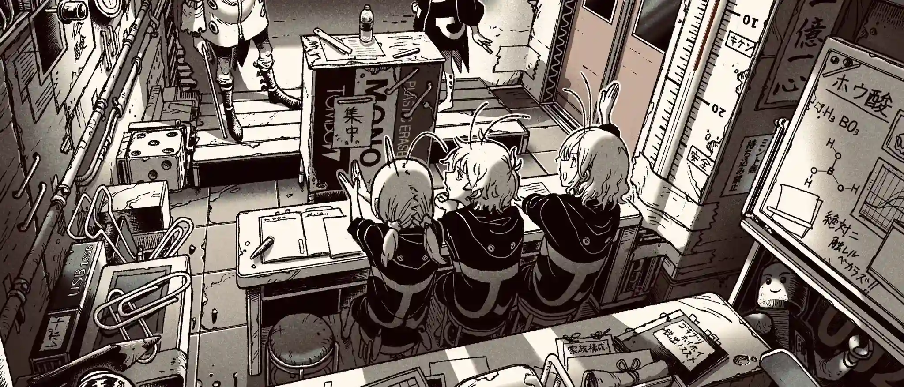

`:::grid` 是本博客的图片画廊容器指令。它将普通 Markdown 图片按统一的宽高比排列为响应式网格，并自动启用灯箱大图浏览。适用于正文配图、界面截图、作品集或小型相册。

同一个画廊内的图片统一使用相同的卡片宽高比。默认情况下，居中裁切会填满每张卡片并保持每行整齐对齐；点击图片可在灯箱中打开未裁切的完整原图。每个画廊拥有独立的灯箱分组，不会与文章中的其他图片混杂。

> 本文既是功能文档，也是视觉测试页面。可以在桌面端、平板端与移动端宽度下查看示例，并点击任意图片验证灯箱分组效果。

## 最简语法

在 `:::grid` 与闭合标记 `:::` 之间直接书写 Markdown 图片：

````markdown
:::grid


:::
````

每张图片必须单独占一个段落，图片之间用空行隔开。画廊内应仅包含图片；段落文字、列表和代码块请写在容器外部。

以下是最简语法的呈现效果。在不提供参数时，网格默认采用三列、`16/10` 比例以及 `cover` 填充模式。

:::grid


:::

## 参数一览

所有参数均写在起始指令后的大括号内：`:::grid{parameter="value"}`。

| 参数名 | 允许值 | 默认值 | 用途说明 |
| --- | --- | --- | --- |
| `columns` | `1` 到 `6` 的整数 | `3` | 桌面端每行的列数。非法值将自动回退为 `3`。 |
| `aspect` | 正数比例，如 `16/9`、`3/4` 或 `1/1` | `16/10` | 展示卡片的宽高比，非原图比例。 |
| `fit` | `cover`, `contain` | `cover` | 图片适应模式。`cover` 裁切填满；`contain` 完整保留原图并可能留白。 |

完整示例：

````markdown
:::grid{columns="3" aspect="16/9" fit="cover"}


:::
````

下面的效果使用了上述三列横屏语法。可以对比卡片比例、列数以及标题优先于替代文本作为图注的规则：

:::grid{columns="3" aspect="16/9" fit="cover"}


:::

## 图注与替代文本

图片的替代文本既用作无障碍文本，也作为默认图注。当图片提供了可选的标题属性时，标题将作为图注展示：

```markdown

```

在同一行中，图注会自动对齐到每张卡片的底部。即使某个图注换行，也不会导致同行其他卡片高度错落。比例文字如 `3:4` 和 `16:9` 可以直接在正文、标题与替代文本中书写，无需转义。

以下示例展示了默认替代文本图注、显式标题图注以及长图注的底部对齐效果：

:::grid{columns="3" aspect="1/1"}


:::

## 布局与裁切

桌面端布局严格遵循 `columns` 指定的列数。在屏幕宽度小于 `768px` 时，网格最多显示两列；小于 `480px` 时切换为单列。卡片外框固定 `aspect` 比例并裁切圆角，图片填满卡片且不带主题默认的图片外边距。

- 选择 `cover`：推荐的默认模式。图片从中心裁切以填满卡片，使画廊保持整齐划一。
- 选择 `contain`：完整显示原始图片而不裁切。当原图比例与卡片不一致时，会露出主题背景色；适用于不可被裁切的图表或截图。
- 若需完整保留原图且不产生留白，可将 `aspect` 设置为接近原图的比例，或将图片放置在专属网格中。

下面的示例将相同的竖屏图片分别置于 `cover` 和 `contain` 模式的 `16/9` 卡片中。前者居中裁切填满，后者保留完整图片并留白：

````markdown
:::grid{columns="3" aspect="16/9" fit="cover"}


:::

:::grid{columns="3" aspect="16/9" fit="contain"}


:::
````

:::grid{columns="3" aspect="16/9" fit="cover"}


:::

:::grid{columns="3" aspect="16/9" fit="contain"}


:::

## 默认配置

未设置任何属性时，默认采用三列、`16/10` 比例与 `cover` 裁切。以下三张竖屏图片验证了默认裁切与图注效果。

````markdown
:::grid


:::
````

:::grid


:::

## 三列竖屏展示：3:4

配置 `aspect="3/4"` 时，三张竖屏图片将填满比例一致的垂直卡片。如果原图比例不同，`cover` 会从中心向外裁切多余边缘。

````markdown
:::grid{columns="3" aspect="3/4"}


:::
````

:::grid{columns="3" aspect="3/4"}


:::

## 三列横屏展示：16:9

这组展示了常见视频封面比例在三列布局下的效果。当横屏图片比例接近卡片比例时，边缘裁切极小。

````markdown
:::grid{columns="3" aspect="16/9"}


:::
````

:::grid{columns="3" aspect="16/9"}


:::

## 两列正方形展示：1:1

当需要更大尺寸的预览卡片时，两列布局非常实用。第三张图片会自动折行到下一行，末行保持网格轨道宽度，不会被拉伸变形。

````markdown
:::grid{columns="2" aspect="1/1"}


:::
````

:::grid{columns="2" aspect="1/1"}


:::

## 四列模式配合 `contain`

`fit="contain"` 不会裁切原图。当图片比例与卡片比例不同时，会露出主题背景色。这是设计预期的正常表现。此示例同时验证了四列网格与独立灯箱分组之间互不干扰。

````markdown
:::grid{columns="4" aspect="16/9" fit="contain"}


:::
````

:::grid{columns="4" aspect="16/9" fit="contain"}


:::

## 单列细节大图

单列模式适合需要较大阅读尺寸的图片。在桌面端、平板端与移动端均保持单列展示，原图依然可在灯箱中无损查看。

````markdown
:::grid{columns="1" aspect="16/9"}

:::
````

:::grid{columns="1" aspect="16/9"}

:::

## 稀疏五列网格

五列模式验证了更高的列数支持。当整行只有三张图片时，末行保持左对齐，不会强行拉伸图片。

````markdown
:::grid{columns="5" aspect="1/1"}


:::
````

:::grid{columns="5" aspect="1/1"}


:::

## 六列混排网格

六列是目前支持的最大列数。混合放置横屏与竖屏图片可验证 `cover` 裁切模式、窄卡片图注以及密集的桌面端布局效果。对于正文阅读场景，通常建议使用二到四列。

````markdown
:::grid{columns="6" aspect="1/1"}


:::
````

:::grid{columns="6" aspect="1/1"}


:::

## 四列正方形展示：1:1

四张比例一致的正方形图片是典型的四列布局应用。桌面端单行呈现全部四张；平板端自动折叠为两列，移动端折叠为单列。

````markdown
:::grid{columns="4" aspect="1/1"}


:::
````

:::grid{columns="4" aspect="1/1"}


:::

## 六列横屏展示：16:9

六列横屏布局非常适合缩略图预览、作品集展示以及截图索引。即使原图比例略有出入，`cover` 也能均匀统一地填满每张 `16/9` 卡片。

````markdown
:::grid{columns="6" aspect="16/9"}


:::
````

:::grid{columns="6" aspect="16/9"}


:::

## 三列竖屏人像：3:4

这组六张竖屏图片展示了人物立绘、海报或手机截图的常见排版。图片分为两行三列排列，图注牢固对齐在底部。

````markdown
:::grid{columns="3" aspect="3/4"}


:::
````

:::grid{columns="3" aspect="3/4"}


:::

## 边缘关键信息处理：`cover` 与灯箱

这些图片在边缘位置包含重要文字或细节。`cover` 能够保证网格工整，但可能会裁剪边缘内容；点击图片可在灯箱中查看未裁切的完整原图。对于边缘敏感的图片，建议配合清晰的图注或改用下方的 `contain` 模式。

````markdown
:::grid{columns="3" aspect="16/9" fit="cover"}


:::
````

:::grid{columns="3" aspect="16/9" fit="cover"}


:::

## 极端比例配合 `contain`

对于横幅长图、超长截图等极端比例图片，`contain` 能够完整呈现原图。虽然它可能会露出背景色，但绝不会裁切丢失任何画面内容。

````markdown
:::grid{columns="3" aspect="16/9" fit="contain"}


:::
````

:::grid{columns="3" aspect="16/9" fit="contain"}





:::

## 透明通道图片

透明背景图片会透出卡片的主题背景色。这个单列 `contain` 示例便于检查透明区域、原始边缘以及灯箱交互行为。

````markdown
:::grid{columns="1" aspect="16/9" fit="contain"}

:::
````

:::grid{columns="1" aspect="16/9" fit="contain"}

:::

## 灯箱导航与交互

点击网格中的任意图片均可唤起 Fancybox 灯箱。在灯箱中支持缩放、旋转、全屏、查看缩略图以及键盘方向键切换。灯箱导航范围严格限制在当前 `:::grid` 容器内：例如点击“16:9 测试图片一”，在灯箱中只能前后切换浏览该章节内的另外两张横屏图片。

同篇文章内的普通 Markdown 图片由独立机制处理，不会被加入到任何画廊分组中。

## 检查清单

1. 每个网格内的图片具有统一尺寸，图注居于卡片下方对齐。
2. 鼠标悬停时图片微幅缩放；点击后可在灯箱中无损缩放、旋转与键盘切换。
3. 点击“16:9 测试图片一”唤起灯箱时，仅能浏览该章节内的横屏图片。
4. 屏幕宽度低于 768px 时网格自动折叠为最多两列，低于 480px 时折叠为单列。
5. 四列模式配合 `contain` 时，竖屏图片完整可见且两侧正常留白，不发生裁切。
6. 五列与六列网格在宽屏下保持指定列数，并在小屏下按响应式规则折叠。
