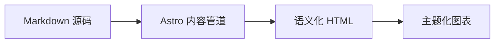

## GitHub 仓库卡片

你可以添加链接到 GitHub 仓库的动态卡片。页面加载时，仓库信息会自动通过 GitHub API 进行拉取并渲染。

::github{repo="Fabrizz/MMM-OnSpotify"}

使用指令代码 `::github{repo="<owner>/<repo>"}` 创建 GitHub 仓库卡片：

```markdown
::github{repo="saicaca/fuwari"}
```

## Mermaid 图表

代码块语言标记为 `mermaid` 的内容会被自动渲染为图表，并跟随当前激活的主题配色。



## 提示块

支持以下类型的提示块：`note`、`tip`、`important`、`warning`、`caution`。

:::note
突出显示用户即使略读也应当留意的信息。
:::

:::tip
提供有助于提升阅读或操作效率的可选辅助信息。
:::

:::important
完成某项任务所必需的关键核心信息。
:::

:::warning
需要立即引起注意的关键内容，通常涉及潜在风险。
:::

:::caution
提醒某个操作可能带来的负面后果。
:::

### 基本语法

```markdown
:::note
突出显示用户即使略读也应当留意的信息。
:::

:::tip
提供有助于提升阅读或操作效率的可选辅助信息。
:::
```

### 自定义标题

提示块的标题可以进行个性化自定义。

:::note[自定义标题示例]
这是一个带有自定义标题的提示块。
:::

```markdown
:::note[自定义标题示例]
这是一个带有自定义标题的提示块。
:::
```

### GitHub Alert 语法

> [!TIP]
> 同时也完整支持 [GitHub Alert 语法](https://github.com/orgs/community/discussions/16925)。

```markdown
> [!NOTE]
> 同时也完整支持 GitHub Alert 语法。

> [!TIP]
> 同时也完整支持 GitHub Alert 语法。
```

### 黑幕剧透

可以在正文中添加黑幕效果。隐藏的文本同样支持 **Markdown** 语法。

这里的内容 :spoiler[已经被完全隐藏了 **悄悄话**]！

```markdown
这里的内容 :spoiler[已经被完全隐藏了 **悄悄话**]！
```

## 图片宽度与图注

单张独立图片支持在替代文本中添加可选的 `w-N%` 宽度标记，并在图片标题中添加居中图注：


```markdown

```

有效的宽度范围为 `w-1%` 到 `w-100%`；非法标记会保留在替代文本中。宽度与图注相互独立，仅提供标题时也会生成居中图注：


