Mermaid 能够将 Markdown 中的文本描述直接转换为可视化图表。以下示例结合 Shirone 的内容工作流，展示了技术文章和项目手记中常用的各种图表类型。

## 流程图

流程图用于描述业务处理流程，包括条件决策以及回退重试路径。

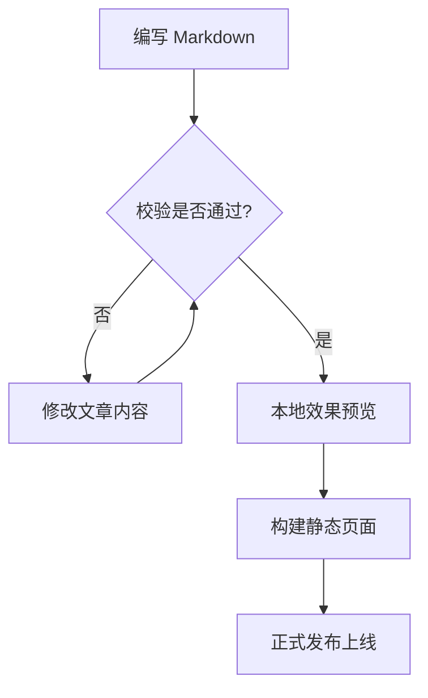

## 时序图

时序图按时间顺序展示不同参与角色之间的协同调用。此示例展示了从发起 Swup 站内跳转到 Mermaid 图表完成渲染的过程。

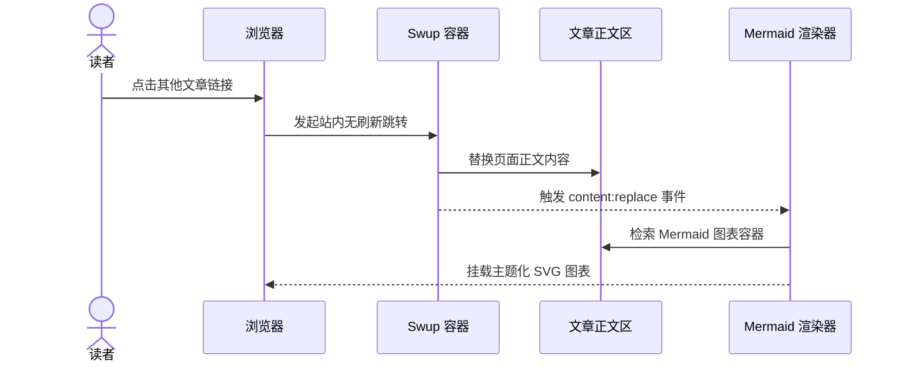

## 实体关系图

实体关系图用于为结构化数据建模，清晰展示作者、文章、标签和评论之间的关联。

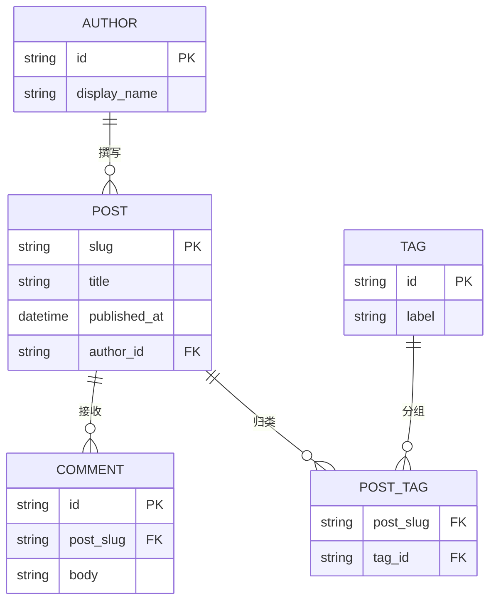

## 类图

类图在软件设计中用于传达职责分工、公开方法与依赖流向。

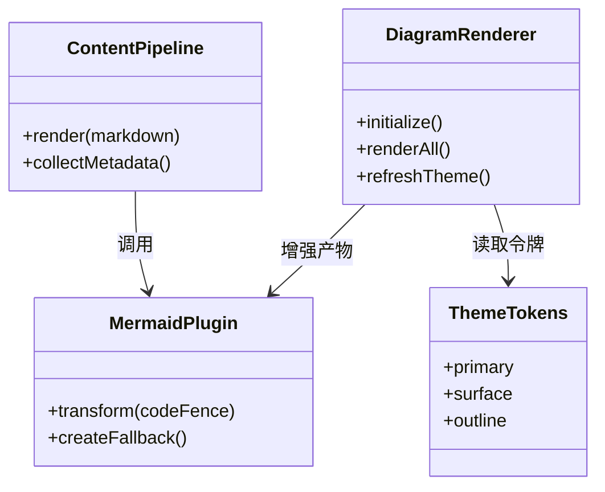

## 状态图

状态图展示对象的完整生命周期以及触发状态转移的事件。

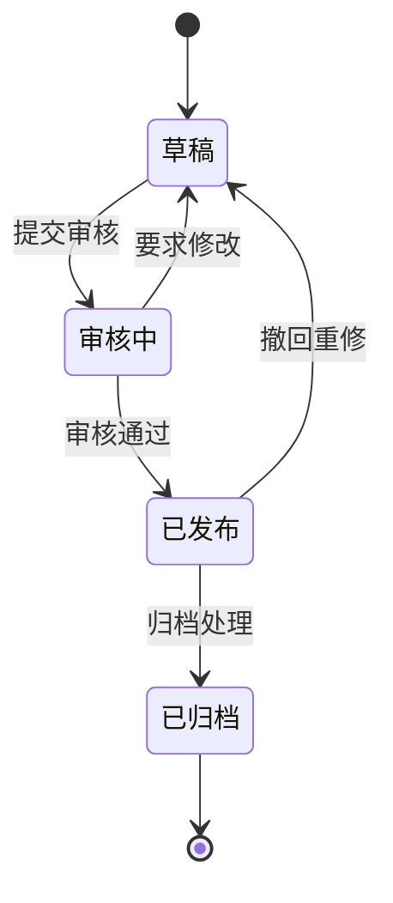

## 坐标图

坐标图通过组合柱状图与折线图，在共享坐标轴上直观对比数值与变化趋势。

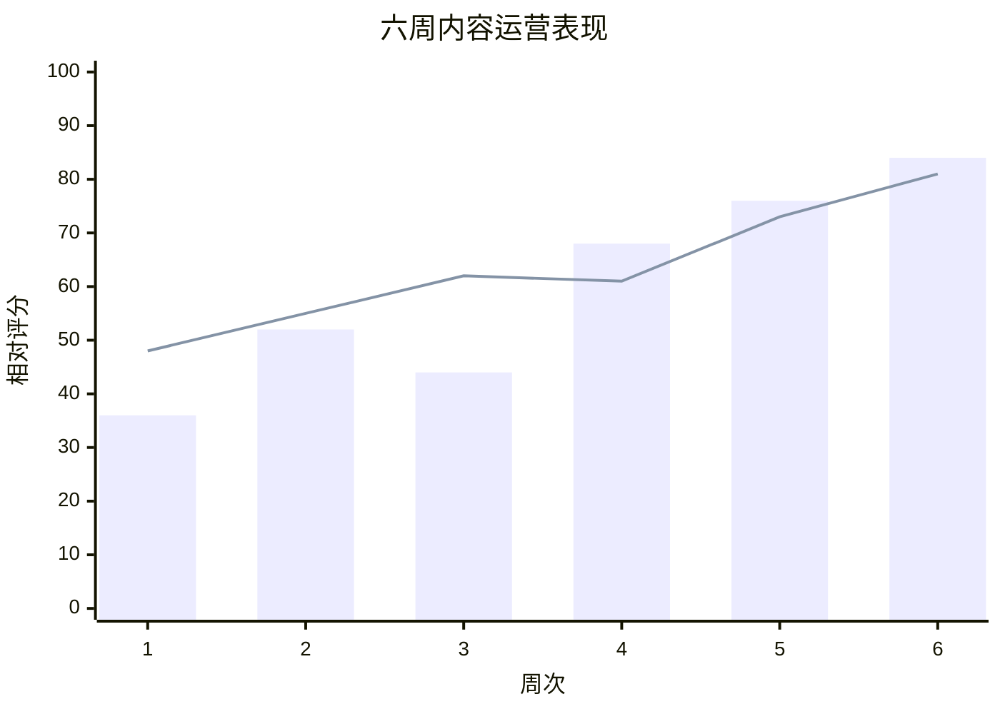

## 饼图

饼图适合紧凑直观地呈现各个类别在整体中所占的份额比例。

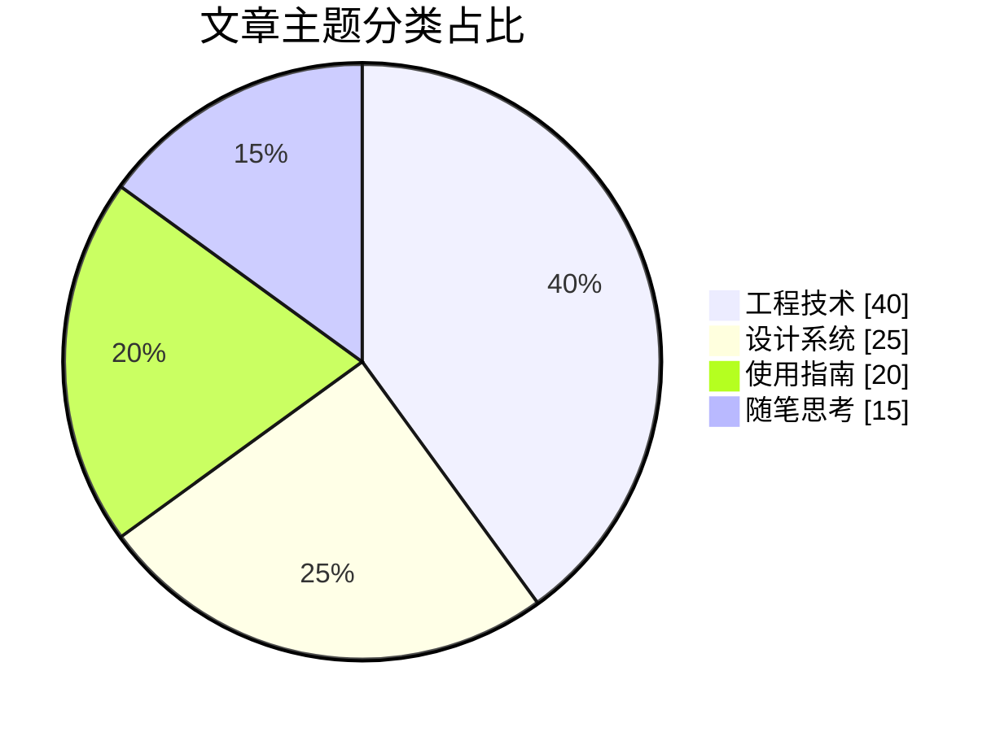

## 甘特图

甘特图按日历时间线清晰规划任务、依赖关系与关键里程碑。

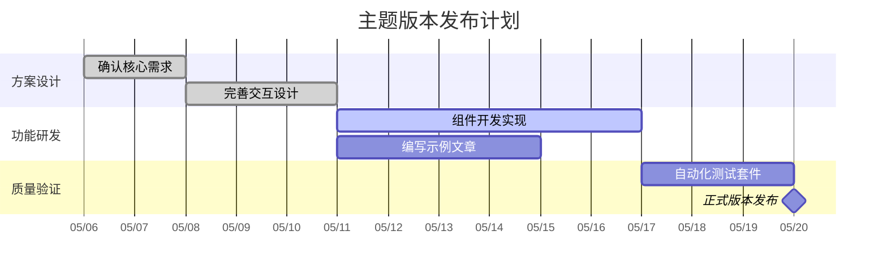

## 思维导图

思维导图以核心主题为中心，向外辐射发散至各个关联领域与细分概念。

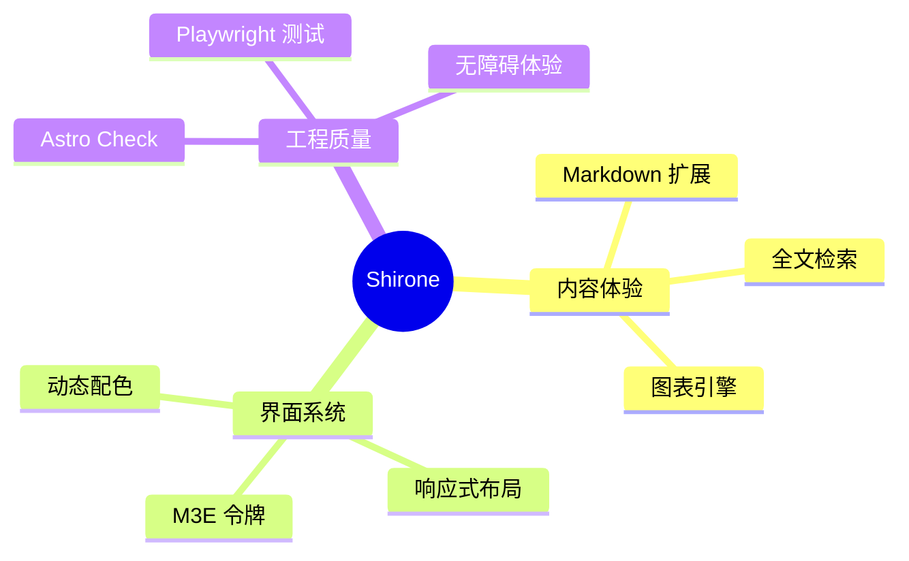

## 时间线

时间线用于概述关键里程碑事件或演进阶段，无需依赖精确的日历时长。

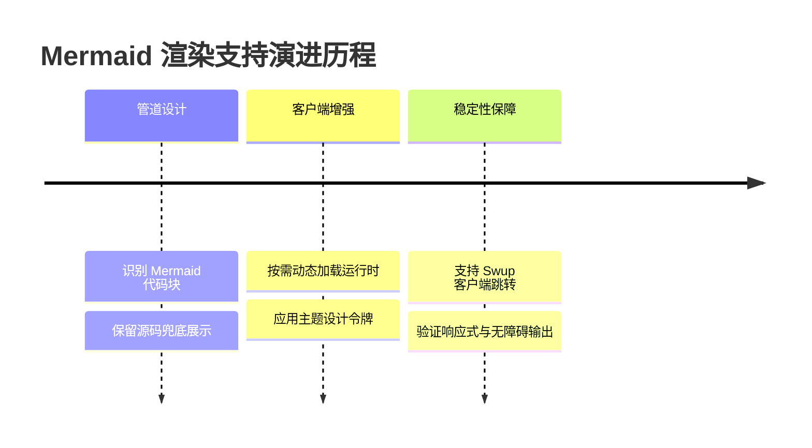

## 用户旅程图

用户旅程图综合了任务各阶段的操作行为、参与角色与满意度评分。

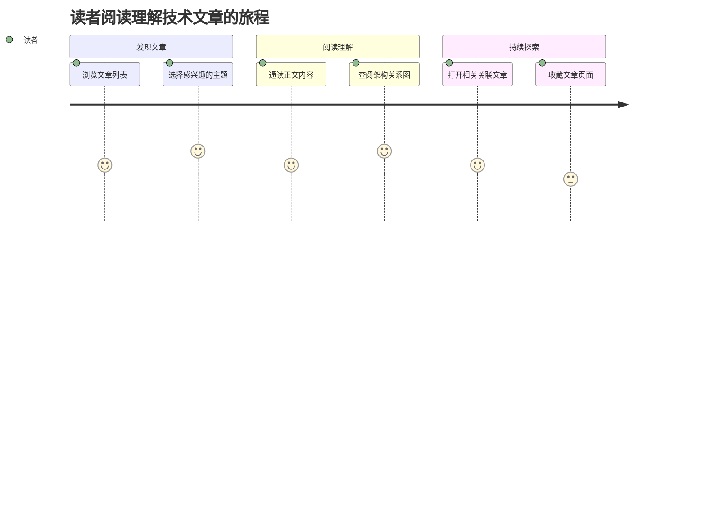

## Git 分支图

Git 分支图展示特性分支在最终合并回主干前的提交推进过程。

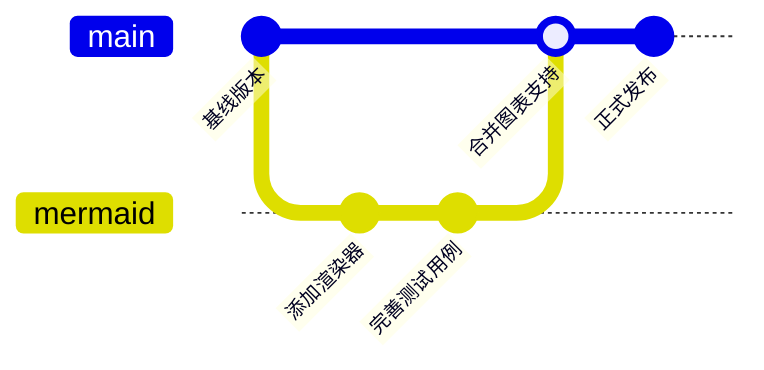

## 看板

看板按工作流状态对任务进行分组，使当前推进进度一目了然。

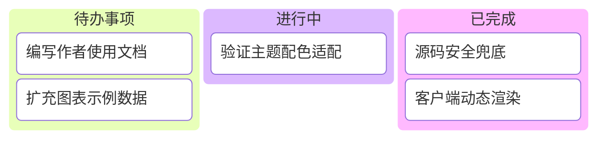

## 桑基图

桑基图通过连线宽度直观展示流量或数据在各个节点之间的流向与分配。

```mermaid
sankey-beta
着陆页,正文阅读,720
发现页,正文阅读,430
正文阅读,深度探索,360
正文阅读,主题分类,210
正文阅读,站外跳转,140
```

每个示例均使用标准的 `mermaid` 代码块声明。服务端保留语义化源码，浏览器将其增强为契合当前主题的 SVG 矢量图表。当主题切换或通过 Swup 跳转进入时，图表会自动重新渲染。